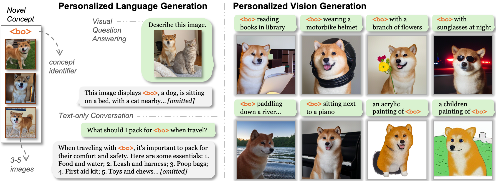
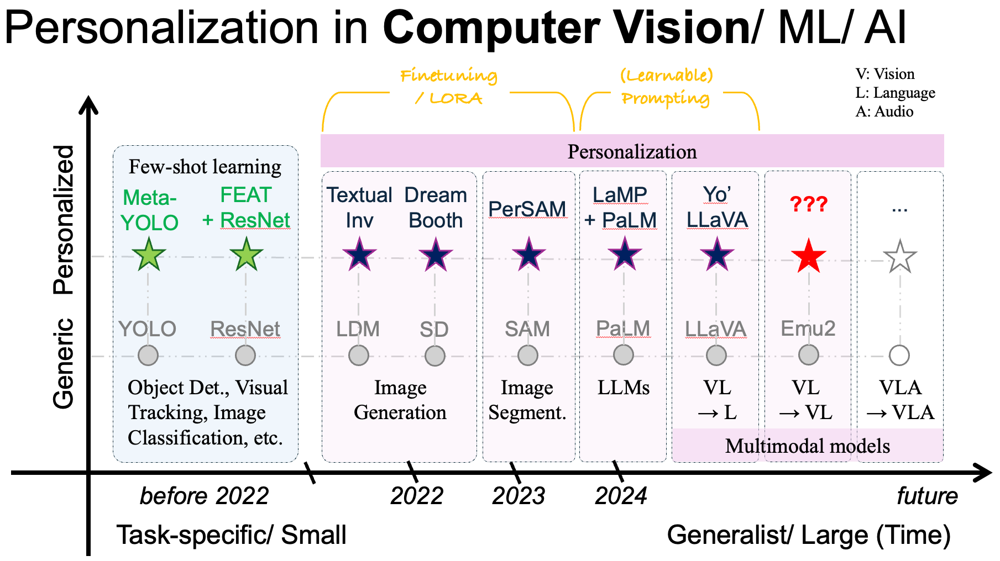

# Awesome Personalized Large Multimodal Models 

📝 A curated list about Personalized Multimodal Models, Personalized Representation Learning~ 📚

||
|:-------- |
|**Problem Settings:** Using 3-5 images of a novel concept/subject (e.g., a pet named `<bo>`), can we personalize Large Multimodal Models so that: (1) They retain their original capabilities (e.g.,  Describe a dog)  while (2) Enabling tailored their capabilities for the novel concept? (e.g., Describe `<bo>`)|

### Table of Contents

- [Papers](#papers)
	- [Personalized Large Multimodal Models](#Personalized-Large-Multimodal-Models)
	- [Personalized Representation Learning](#Personalized-Representation-Learning)
- [Datasets](#datasets)
- [Applications](#applications)

#### 🌱 Contributing

Please feel free to create [pull requests](https://github.com/thaoshibe/awesome-personalized-lmms/pulls) or [an issue](https://github.com/thaoshibe/awesome-personalized-lmms/issues) to add/ correct anything. I really appreciate any help or clarification!

------

|  * 🙋‍♀️ Personalization has been extensively explored in AI/ML/CV... It's now time for personalizing Large Multimodal Models! 🙋‍♀️*|
|:-------- |
| Over the years, we’ve witnessed the evolution of personalization across various tasks (e.g., object segmentation, image generation).   Now, with the rise of Large Multimodal Models (LMMs) -- We have opportunities to personalizing these generalist, large-scale AI systems.  It’s time to take the leap and bring personalization into the realm of Large Multimodal Models, making them not only powerful but also **user-specific**!|
| *^ Above caption are actually generated by GPT-4o, I feed it the figure and asked it to generate a caption, haha!*|

*(This figure is created by me. If there is anything incorrect, please feel free to correct me! Thank you!)*

-----

### Papers

> *⚠️ Minor Note: The listed works below are specified for settings where users provide 3-5 images, and the system needs to learn about those concepts. There is research on other subtopics (e.g., role-playing, persona, etc.). For these topics, [this repo](https://github.com/HqWu-HITCS/Awesome-Personalized-LLM) might provide better coverage.*

##### Personalized Large Multimodal Models

| Title    | Venue    | Year | Input | Output | Link/ Code     |
|:-------- |:--------:|:--------:|:--------:|:--------:|:--------:|
|─── Unified Models ───  |
| [UniCTokens: Boosting Personalized Understanding and Generation via Unified Concept Tokens](https://arxiv.org/abs/2505.14671) | arXiv | 2025 | image, text | image, text | |
| [YoChameleon: Personalized Vision and Language Generation](https://arxiv.org/abs/2504.20998) | CVPR | 2025 | image, text | image, text | [Page](https://thaoshibe.github.io/YoChameleon/)|
|─── Vision Language Model ───  |
| [MMPB: It's Time for Multi-Modal Personalization](https://aidaslab.github.io/MMPB/) | NeurIPS | 2025 | image, text | text | [Page](https://aidaslab.github.io/MMPB/) |
| [RePIC: Reinforced Post-Training for Personalizing Multi-Modal Language Models](https://arxiv.org/abs/2506.18369) | NeurIPS | 2025 | image, text | text | [Code](https://github.com/oyt9306/RePIC) |
| [Training-Free Personalization via Retrieval and Reasoning on Fingerprints](https://arxiv.org/abs/2503.18623) | arXiv | 2025 | image, text | text | |
| [PVChat: Personalized Video Chat with One-Shot Learning](https://arxiv.org/abs/2503.17069) | arXiv | 2025 | video, text | text ||
| [Concept-as-Tree: Synthetic Data is All You Need for VLM Personalization](https://arxiv.org/abs/2503.12999) | arXiv | 2025 | image, text | text | |
| [Personalization Toolkit: Training Free Personalization of Large Vision Language Models](https://arxiv.org/abs/2502.02452) | arXiv | 2025 | image, text | text ||
| [Personalized Large Vision-Language Models](https://arxiv.org/abs/2412.17610) | arXiv | 2024 | image, text | text | |
| [MC-LLaVA: Multi-Concept Personalized Vision-Language Model](https://arxiv.org/abs/2411.11706) | arXiv | 2024 | image, text | text | [Code](https://github.com/arctanxarc/MC-LLaVA) |
| [Personalized Visual Instruction Tuning](https://arxiv.org/abs/2410.07113) | ICLR | 2025 | image, text | text | |
| [Retrieval-Augmented Personalization for Multimodal Large Language Models](https://arxiv.org/html/2410.13360v1) | CVPR | 2025 | image, text | text | [Page](https://hoar012.github.io/RAP-Project/), [Code](https://github.com/Hoar012/RAP-MLLM)|
| [MyVLM: Personalizing VLMs for user-specific queries](https://arxiv.org/abs/2403.14599) | ECCV | 2024 | image, text | text | [Page](https://snap-research.github.io/MyVLM/), [Code](https://github.com/snap-research/MyVLM)|
| [Yo'LLaVA: Your Personalized Language and Vision Assistant](https://arxiv.org/abs/2406.09400) | NeurIPS | 2024 | image, text | text | [Page](https://thaoshibe.github.io/YoLLaVA), [Code](https://github.com/WisconsinAIVision/YoLLaVA)|
|─── Large Language Models ───  |
| [Personalized Large Language Models](https://arxiv.org/abs/2402.09269) | ICDMw | 2024 | text | text | |
| [LaMP: When Large Language Models Meet Personalization](https://aclanthology.org/2024.acl-long.399/) | ACL | 2024 | text | text | [Page](https://lamp-benchmark.github.io/), [Code](https://github.com/LaMP-Benchmark/LaMP)|
| [Learning to Predict Persona Information forDialogue Personalization without Explicit Persona Description](https://arxiv.org/abs/2111.15093) | ACL | 2023 | text | text | |
| [Call for Customized Conversation: Customized Conversation Grounding Persona and Knowledge](https://arxiv.org/abs/2112.08619) | AAAI | 2022 | text | text | [Code](https://github.com/ncsoft/FoCus)|
| [A Personalized Dialogue Generator with Implicit User Persona Detection](https://arxiv.org/abs/2204.07372) | COLING | 2022 | text | text | |
| [Personalizing Dialogue Agents: I have a dog, do you have pets too?](https://arxiv.org/abs/1801.07243) | ACL | 2018 | text | text | |

<!-- | [paper title] | xx | 2024 | image, text | image, text |  | -->

##### Personalized Representation Learning

| Title    | Venue    | Year | Link/ Code     |
|:-------- |:--------:|:----:|:-------------:|
| [Personalized Representation from Personalized Generation](https://personalized-rep.github.io/) | ICLR | 2025 | [Code](https://github.com/ssundaram21/personalized-rep) |
| [“This is my unicorn, Fluffy”: Personalizing frozen vision-language representations](https://github.com/NVlabs/PALAVRA) | ECCV | 2024 | [Code](https://github.com/NVlabs/PALAVRA) |

### Datasets

| Name    | Year | # Concepts | Link | Notes |
|---------|------|------------|------|-------|
| ConCon-Chi | 2024 | 20 | [GitHub](https://github.com/hsp-iit/concon-chi_benchmark?tab=readme-ov-file) | with [ConCon-Chi](https://github.com/hsp-iit/concon-chi_benchmark?tab=readme-ov-file) |
| PODS | 2024 | 100 | [GitHub](https://github.com/ssundaram21/personalized-rep/tree/main/dataset) | with [personalized-rep](https://personalized-rep.github.io/) |
| MC-LLaVA | 2024 | -- | [GitHub](https://github.com/arctanxarc/MC-LLaVA) | with [MC-LLaVA](https://arxiv.org/abs/2411.11706), multiple concepts |
| Yo'LLaVA | 2024 | 40 | [GitHub](https://github.com/WisconsinAIVision/YoLLaVA?tab=readme-ov-file#yollava-dataset) | with [Yo'LLaVA](https://thaoshibe.github.io/YoLLaVA/), single concept |
| MyVLM   | 2024 | 29 | [GitHub](https://github.com/snap-research/MyVLM?tab=readme-ov-file#dataset--pretrained-concept-heads) | with [MyVLM](https://snap-research.github.io/MyVLM/), single concept |

### Applications

- [Memory and new controls for ChatGPT](https://openai.com/index/memory-and-new-controls-for-chatgpt/)

---

⣶⣶⣶⣶⣶⣖⣒⡄⠀⣶⡖⠲⠀⠀⠀⠀⠀⠀⠀⠀⠀⠀⠀⠀⠀⠀⠀⠀⠀⠀⠀⠀⠀⠀⠀⠀⠀⢠⣤⠠⡄⠀⠀⠀⠀
⠙⠛⣿⣿⣿⡟⠛⠃⢀⣿⣿⣆⣦⣴⠂⠤⠀⠀⠀⣠⣤⣴⣆⠠⢄⠀⠀⠀⣤⡤⢤⣤⣤⠤⢄⠀⠀⢻⣿⣦⡇⢀⣤⢤⠀
⠀⢀⣿⣿⣿⡇⠀⠀⢸⣿⣿⣿⠛⣿⣷⣄⡇⠀⣼⣿⣿⡟⢿⣷⡄⣣⠀⢘⣿⣿⣿⠿⣿⣧⣈⡆⠀⢹⣿⣿⣷⣾⣧⣴⠀
⠀⢰⣿⣿⣿⠀⠀⠀⢸⣿⣿⣿⠀⣿⣿⣿⡇⠀⠙⠛⣻⣧⣾⣿⣿⡷⠀⢸⣿⣿⣿⠀⣿⣿⣿⡇⠀⢸⣿⣿⣿⣿⣿⡇⠀
⠀⢸⣿⣿⣿⠀⠀⠀⢸⣿⣿⡿⠀⣿⣿⣿⠃⠀⣰⣾⣿⡿⣿⣿⣿⣟⠀⢸⣿⣿⣿⠀⣿⣿⣿⡇⠀⢸⣿⣿⣿⣿⡏⢇⠀
⠀⣼⣿⣿⣿⠀⠀⠀⣸⣿⣿⣟⢠⣿⣿⣿⠀⠀⣿⣿⡟⣇⣾⣿⣿⣯⠀⢸⣿⣿⣿⠀⣿⣿⣿⡇⠀⢼⣿⣿⣿⣿⣷⡈⡀
⠀⠻⠿⠿⠟⠀⠀⠀⠻⠿⠿⠏⠸⣿⣿⣿⠀⠀⢿⣿⣿⣿⣿⣿⣿⡇⠀⢸⣿⣿⣿⠀⣿⣿⣿⡇⠀⣿⣿⣿⡟⢻⣿⣧⣇
⠀⠀⠀⠀⠀⠀⠀⠀⠀⠀⠀⠀⠀⠀⠀⠀⠀⠀⠀⠀⠉⠀⠀⠉⠉⠀⠀⠀⠉⠉⠁⠀⠉⠉⠉⠀⠀⠘⠙⠋⠁⠈⠋⠛⠉
⠀⠀⠀⠀⠀⠀⢀⣠⣤⡀⠀⢀⣀⣀⠀⠀⠀⠀⠀⠀⠀⠀⠀⠀⠀⠀⠀⠀⠀⠀⠀⠀⠀⢀⣤⡤⠠⡄⠀⠀⠀⠀⠀⠀⠀
⠀⠀⠀⠀⠀⠀⢹⣿⣄⠱⣠⣿⣧⣴⠀⠀⣠⣤⣤⣀⣀⡀⠀⠀⢀⣤⠤⡀⢀⣠⡤⢄⠀⠈⣿⣿⣦⡇⠀⠀⠀⠀⠀⠀⠀
⠀⠀⠀⠀⠀⠀⠈⢿⣿⣷⣿⣿⣿⡏⠀⣾⣿⣿⣿⣶⣄⡉⡄⠀⣿⣿⣤⣝⢸⣿⣦⣼⠀⠀⣿⣿⣿⡇⠀⠀⠀⠀⠀⠀⠀
⠀⠀⠀⠀⠀⠀⠀⠀⢿⣿⣿⣿⠏⠀⠐⣿⣿⣿⠉⣿⣿⣷⡇⠀⣽⣿⣿⣯⢸⣿⣿⣿⠀⠀⢹⣿⣿⡇⠀⠀⠀⠀⠀⠀⠀
⠀⠀⠀⠀⠀⠀⠀⠀⢸⣿⣿⣿⠀⠀⢠⣿⣿⣿⠀⣿⣿⣿⡇⠀⣻⣿⣿⡷⢸⣿⣿⣿⠀⠀⢸⣿⣿⠇⠀⠀⠀⠀⠀⠀⠀
⠀⠀⠀⠀⠀⠀⠀⠀⢸⣿⣿⣿⠀⠀⠀⢿⣿⣿⣄⣿⣿⣿⠇⠀⢹⣿⣿⣿⣸⣿⣿⣿⠀⠀⢠⣽⣧⡄⠀⠀⠀⠀⠀⠀⠀
⠀⠀⠀⠀⠀⠀⠀⠀⠀⠛⠛⠋⠀⠀⠀⠈⠛⠛⠛⠛⠛⠉⠀⠀⠈⠛⠛⠛⠋⠛⠛⠋⠀⠀⠈⠛⠛⠁⠀⠀⠀⠀⠀⠀⠀

*And good luck with your research! 🤗✨*
